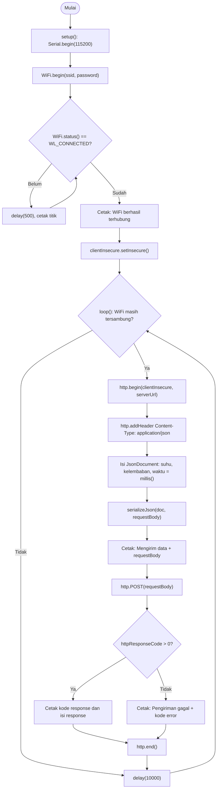

Nama: Iven  
NIM: H1H024013 
Shift Awal: A
Shift Akhir: A

---

# Modul 3: Komunikasi Data HTTP dan MQTT pada ESP8266

Modul ini mempertemukan dua protokol yang sering dipakai di proyek IoT, yaitu HTTP dan MQTT, dengan JSON sebagai format datanya (dirakit lewat pustaka ArduinoJson). Percobaan pertama mengirim data suhu dan kelembaban dari board ke server memakai HTTP POST. Percobaan kedua mempublikasikan data serupa ke broker MQTT publik dengan pola publish-subscribe.

Modul aslinya ditulis untuk ESP32 (`WiFi.h` dan `HTTPClient.h`), sedangkan board yang saya pakai adalah ESP8266 NodeMCU, jadi pustakanya saya ganti ke `ESP8266WiFi.h` dan `ESP8266HTTPClient.h`. Endpoint httpbin.org memakai HTTPS; itu sebabnya saya menambahkan `WiFiClientSecure.h` dan memanggil `setInsecure()` supaya board tetap bisa tersambung tanpa memeriksa sertifikat SSL (cukup untuk praktikum, tidak untuk produk sungguhan). Percobaan MQTT nyaris tidak perlu perubahan, karena PubSubClient bekerja sama di kedua board.

## Alat dan Bahan

- Board ESP8266 (NodeMCU), 1 buah
- Kabel Micro-USB
- Laptop dengan Arduino IDE yang board manager ESP8266-nya sudah terpasang
- Jaringan WiFi dengan akses internet
- Aplikasi client MQTT (HiveMQ WebSocket Client) untuk memeriksa data yang masuk ke broker
- Broker publik `broker.hivemq.com` port 1883
- Endpoint uji `httpbin.org/post`

## Library

- `ESP8266WiFi.h`: bawaan board manager ESP8266, menyambungkan board ke WiFi sebagai klien.
- `WiFiClientSecure.h`: membangun koneksi HTTPS ke httpbin.org.
- `ESP8266HTTPClient.h`: mengirim request HTTP POST di percobaan 3A.
- PubSubClient (Nick O'Leary), dipasang lewat Library Manager: dasar komunikasi MQTT di percobaan 3B.
- ArduinoJson (Benoit Blanchon), juga lewat Library Manager: menyusun data sensor menjadi JSON di kedua percobaan.

---

# Percobaan 3A: Komunikasi Data Menggunakan HTTP

## Tujuan

Mengirim data suhu dan kelembaban dari ESP8266 ke server lewat HTTP POST dalam format JSON, lalu menambahkan data waktu dari `millis()` ke dalam JSON tersebut.

## Rangkaian

Tidak ada rangkaian tambahan. Nilai suhu dan kelembaban masih berupa angka contoh, bukan hasil baca sensor, jadi board cukup disambungkan ke laptop lewat USB untuk mengunggah program dan memantau Serial Monitor.

## Kode Program

```cpp
#include <ESP8266WiFi.h>
#include <WiFiClientSecure.h>
#include <ESP8266HTTPClient.h>
#include <ArduinoJson.h>

const char* ssid = "vivo Y17s";
const char* password = "Aditiaaaa";
const char* serverUrl = "https://httpbin.org/post";

// Client untuk koneksi HTTPS
WiFiClientSecure clientInsecure;

void setup() {
  Serial.begin(115200);
  WiFi.begin(ssid, password);

  Serial.print("Menghubungkan ke WiFi");
  while (WiFi.status() != WL_CONNECTED) {
    delay(500);
    Serial.print(".");
  }

  Serial.println();
  Serial.println("WiFi berhasil terhubung!");

  // Tidak melakukan verifikasi sertifikat SSL
  clientInsecure.setInsecure();
}

void loop() {
  if (WiFi.status() == WL_CONNECTED) {

    HTTPClient http;

    // Koneksi HTTPS menggunakan WiFiClientSecure
    http.begin(clientInsecure, serverUrl);
    http.addHeader("Content-Type", "application/json");

    // Membuat objek data sensor dalam format JSON
    JsonDocument doc;
    doc["suhu"] = 28.5;
    doc["kelembaban"] = 65.0;

    // Menambahkan data waktu sejak ESP8266 dinyalakan
    doc["waktu"] = millis();

    String requestBody;
    serializeJson(doc, requestBody);

    Serial.print("Mengirim data: ");
    Serial.println(requestBody);

    // Mengirim data melalui HTTP POST
    int httpResponseCode = http.POST(requestBody);

    if (httpResponseCode > 0) {
      Serial.print("Kode Response HTTP: ");
      Serial.println(httpResponseCode);
      Serial.println("Isi Response:");
      Serial.println(http.getString());
    } else {
      Serial.print("Pengiriman gagal, kode error: ");
      Serial.println(httpResponseCode);
    }

    http.end();
  }

  delay(10000); // kirim data setiap 10 detik
}
```

## Penjelasan Kode

Empat baris `#include` di bagian atas memanggil pustaka untuk WiFi, HTTPS, HTTP client, dan JSON. `ssid` dan `password` menyimpan identitas jaringan WiFi, sementara `serverUrl` berisi alamat tujuan kiriman, yaitu endpoint uji `httpbin.org/post`.

Objek `clientInsecure` (tipe `WiFiClientSecure`) sengaja saya letakkan di luar semua fungsi. Dengan begitu objek yang sama bisa dipakai lagi di tiap putaran `loop()` tanpa dibuat ulang, dan pengaturan `setInsecure()` yang cuma dipanggil sekali di `setup()` tetap berlaku.

### Fungsi yang dipakai

| Fungsi | Peran |
|---|---|
| `Serial.begin(115200)` | Membuka komunikasi serial ke laptop pada 115200 baud, supaya proses kirim bisa dibaca di Serial Monitor. |
| `WiFi.begin(ssid, password)` | Memulai koneksi ke jaringan WiFi dengan nama dan sandi yang sudah ditentukan. |
| `WiFi.status()` | Melaporkan status koneksi; `WL_CONNECTED` berarti sambungan sudah jadi. |
| `clientInsecure.setInsecure()` | Menyuruh koneksi HTTPS berjalan tanpa memeriksa sertifikat SSL server. |
| `http.begin(clientInsecure, serverUrl)` | Menyiapkan koneksi HTTPS ke server lewat objek client tadi. |
| `http.addHeader("Content-Type", "application/json")` | Memberi tahu server bahwa body request berformat JSON. |
| `JsonDocument doc` | Wadah data sensor berbentuk key-value; diisi lewat `doc["suhu"]`, `doc["kelembaban"]`, dan `doc["waktu"]`. |
| `millis()` | Mengembalikan berapa milidetik board sudah menyala sejak terakhir di-reset; dipakai untuk isi `doc["waktu"]`. |
| `serializeJson(doc, requestBody)` | Mengubah isi `doc` menjadi string JSON yang siap jadi body request. |
| `http.POST(requestBody)` | Mengirim body lewat HTTP POST dan mengembalikan kode response dari server. |
| `http.getString()` | Mengambil isi response; di sini berupa data JSON yang di-echo oleh httpbin.org. |
| `http.end()` | Menutup koneksi HTTP dan melepas sumber daya yang dipakainya. |
| `delay(10000)` | Menahan program 10 detik sebelum pengiriman berikutnya. |

### Percabangan dan perulangan

`while (WiFi.status() != WL_CONNECTED)` di `setup()` berjalan selama WiFi belum tersambung; tiap putaran menunggu 500 milidetik lalu mencetak satu titik, dan berhenti begitu statusnya berubah menjadi `WL_CONNECTED`.

Di `loop()`, `if (WiFi.status() == WL_CONNECTED)` menjaga agar pengiriman hanya jalan saat board masih online. Kalau WiFi putus, seluruh blok itu dilompati pada putaran tersebut.

Di dalam blok pengiriman ada `if (httpResponseCode > 0)`. Kondisi benar berarti request terkirim dan server membalas, sehingga program mencetak kode response beserta isinya. Kondisi salah menandakan pengiriman gagal (misalnya timeout), dan cabang `else` mencetak pesan gagal bersama kode errornya.

## Hasil Serial Monitor Percobaan 3A

Log di bawah ini dari run saya sendiri, diambil sebelum baris `waktu` saya tambahkan. Alamat IP pada `origin` saya sensor.

```text
13:54:22.693 -> .............................................................................................
13:55:45.325 -> WiFi berhasil terhubung!
13:55:45.361 -> Mengirim data: {"suhu":28.5,"kelembaban":65}
13:55:48.547 -> Kode Response HTTP: 200
13:55:48.547 -> Isi Response:
13:55:48.547 -> {
13:55:48.547 ->   "args": {},
13:55:48.579 ->   "data": "{\"suhu\":28.5,\"kelembaban\":65}",
13:55:48.579 ->   "files": {},
13:55:48.579 ->   "form": {},
13:55:48.579 ->   "headers": {
13:55:48.579 ->     "Accept-Encoding": "identity;q=1,chunked;q=0.1,*;q=0",
13:55:48.579 ->     "Content-Length": "29",
13:55:48.579 ->     "Content-Type": "application/json",
13:55:48.579 ->     "Host": "httpbin.org",
13:55:48.579 ->     "User-Agent": "ESP8266HTTPClient",
13:55:48.579 ->     "X-Amzn-Trace-Id": "Root=1-6aa8ebf7-26a486f412bb03ae67df6329"
13:55:48.579 ->   },
13:55:48.579 ->   "json": {
13:55:48.623 ->     "kelembaban": 65,
13:55:48.623 ->     "suhu": 28.5
13:55:48.623 ->   },
13:55:48.623 ->   "origin": "xxx.xxx.xxx.xxx",
13:55:48.623 ->   "url": "https://httpbin.org/post"
13:55:48.623 -> }
13:55:58.584 -> Mengirim data: {"suhu":28.5,"kelemb...
```

Yang bisa dibaca dari log ini: koneksi WiFi butuh sekitar 83 detik (titik pertama 13:54:22, tersambung 13:55:45); satu siklus kirim sampai response makan sekitar 3,2 detik; kiriman berikutnya mulai 13:55:58, sesuai `delay(10000)`; dan `65.0` di kode tercetak sebagai `65` karena ArduinoJson membuang nol di belakang koma.

> Tempel tangkapan layar Serial Monitor setelah `waktu` ditambahkan di sini.


# Percobaan 3B: Komunikasi Data Menggunakan MQTT

## Tujuan

Mempublikasikan data JSON dari ESP8266 ke broker MQTT publik (`broker.hivemq.com`) dengan pola publish-subscribe, lalu memastikan datanya sampai lewat client MQTT yang subscribe ke topic yang sama.

## Rangkaian

Sama seperti 3A: hanya board ESP8266 yang tersambung ke laptop lewat USB.

## Kode Program

```cpp
#include <ESP8266WiFi.h>
#include <ESP8266HTTPClient.h>
#include <WiFiClientSecure.h> // Tambahan wajib untuk HTTPS di ESP8266
#include <ArduinoJson.h>

const char* ssid = "vivo Y17s";
const char* password = "Aditiaaaa";
const char* serverUrl = "https://httpbin.org/post"; // endpoint uji HTTP POST

void setup() {
  Serial.begin(115200);
  WiFi.begin(ssid, password);
  Serial.print("Menghubungkan ke WiFi");
  while (WiFi.status() != WL_CONNECTED) {
    delay(500);
    Serial.print(".");
  }
  Serial.println();
  Serial.println("WiFi berhasil terhubung!");
}

void loop() {
  if (WiFi.status() == WL_CONNECTED) {
    WiFiClientSecure client; 
    client.setInsecure(); // Mengabaikan verifikasi sertifikat SSL agar praktis

    HTTPClient http;
    // ESP8266 butuh argumen 'client' disisipkan sebelum serverUrl
    http.begin(client, serverUrl); 
    http.addHeader("Content-Type", "application/json");
    
    // Membuat objek data sensor dalam format JSON
    JsonDocument doc;
    doc["suhu"] = 28.5;       // contoh data suhu (°C)
    doc["kelembaban"] = 65.0; // contoh data kelembaban (%)
    String requestBody;
    serializeJson(doc, requestBody);
    
    Serial.print("Mengirim data: ");
    Serial.println(requestBody);
    
    // Mengirim data melalui HTTP POST
    int httpResponseCode = http.POST(requestBody);
    if (httpResponseCode > 0) {
      Serial.print("Kode Response HTTP: ");
      Serial.println(httpResponseCode);
      Serial.println("Isi Response:");
      Serial.println(http.getString());
    } else {
      Serial.print("Pengiriman gagal, kode error: ");
      Serial.println(httpResponseCode);
    }
    http.end();
  }
  delay(10000); // kirim data setiap 10 detik
}
```

## Penjelasan Kode

Include `ESP8266WiFi.h`, `WiFiClient.h`, `PubSubClient.h`, dan `ArduinoJson.h` menyediakan WiFi, koneksi TCP biasa, client MQTT, dan JSON. `mqttServer` serta `mqttPort` menyimpan alamat broker dan port bawaan MQTT (1883). `mqttTopic` adalah topic tempat data dititipkan; saya beri nama unik dengan menyertakan nama kelompok supaya tidak bentrok dengan kelompok lain di broker publik yang sama.

Objek `espClient` (tipe `WiFiClient`) menyediakan jalur TCP dasar, dan `client` (tipe `PubSubClient`) dibangun di atasnya untuk menjalankan protokol MQTT.

### Fungsi yang dipakai

| Fungsi | Peran |
|---|---|
| `hubungkanWiFi()` | Fungsi buatan sendiri: memanggil `WiFi.begin` lalu menunggu sampai `WL_CONNECTED`, sama seperti di 3A. |
| `hubungkanMQTT()` | Fungsi buatan sendiri untuk menyambung ke broker. `clientId` disusun dari awalan `ESP32Client-` plus `random(0xffff)`, supaya tiap perangkat di broker publik punya identitas berbeda, lalu `client.connect(clientId.c_str())` dipanggil. |
| `client.state()` | Mengembalikan kode alasan (rc) saat `client.connect` gagal; berguna untuk mencari penyebabnya. |
| `client.setServer(mqttServer, mqttPort)` | Menentukan alamat dan port broker; dipanggil sekali di `setup()` setelah WiFi tersambung. |
| `client.connected()` | Bernilai `true` selama client masih terhubung ke broker. |
| `client.loop()` | Dipanggil di setiap putaran `loop()` agar pesan masuk-keluar diproses dan koneksi tetap hidup lewat keep-alive. |
| `serializeJson(doc, buffer)` | Mengubah `JsonDocument` menjadi teks JSON di dalam `buffer` (char array). |
| `client.publish(mqttTopic, buffer)` | Mengirim isi `buffer` ke topic yang sudah ditentukan. |
| `delay(5000)` | Jeda 5 detik antar publish. |

### Percabangan dan perulangan

`while (WiFi.status() != WL_CONNECTED)` di dalam `hubungkanWiFi()` bekerja sama persis dengan versi 3A: menunggu sampai WiFi tersambung.

`while (!client.connected())` di dalam `hubungkanMQTT()` terus mencoba menyambung ke broker sampai berhasil. Percobaannya diperiksa dengan `if (client.connect(clientId.c_str()))`: kalau berhasil, program mencetak pesan sukses dan keluar dari perulangan; kalau gagal, program mencetak kode error (rc) dan pesan bahwa ia akan mencoba lagi, lalu menunggu 2 detik.

Di `loop()`, `if (!client.connected())` memeriksa apakah koneksi ke broker masih hidup. Kalau ternyata putus, `hubungkanMQTT()` dipanggil lagi untuk menyambung ulang sebelum proses publish dilanjutkan.

> Tempel tangkapan layar Serial Monitor dan aplikasi client MQTT untuk Percobaan 3B di sini.


# Pertanyaan Praktikum - Percobaan 3A

## 1. Gambarkan diagram alur (flowchart) proses pengiriman data melalui HTTP POST pada program di atas!

Flowchart ini mengikuti program final: ESP8266 menyambung ke WiFi dulu, mengatur client HTTPS, lalu masuk ke `loop()` untuk merakit JSON (termasuk `waktu`) dan mengirimnya ke httpbin.org, kemudian diam 10 detik sebelum mengulang.



---

## 2. Apa fungsi dari perintah http.addHeader("Content-Type", "application/json") pada program tersebut?

Baris ini menempelkan header `Content-Type: application/json` pada request sebelum dikirim. Header itu semacam label untuk server: isi yang menyusul di body adalah JSON, bukan teks polos atau data form. Dengan label tersebut server tahu harus membaca body sebagai objek berisi pasangan key-value, lalu mengurainya sesuai strukturnya.

Buktinya ada di log Serial Monitor saya. Response httpbin mencantumkan `"Content-Type": "application/json"` di bagian `headers`, dan kolom `json` terisi dua nilai yang saya kirim, yaitu `kelembaban` dan `suhu`.

---

## 3. Jelaskan arti dari kode response HTTP 200 dan sebutkan salah satu contoh kode response HTTP lain beserta artinya!

Kode 200 (OK) berarti server menerima request dan memprosesnya tanpa masalah. Di percobaan ini httpbin.org membalas dengan 200 sambil mengembalikan JSON kiriman saya di dalam response body, sehingga terlihat jelas bahwa `suhu` 28.5 dan `kelembaban` 65 sampai dengan utuh.

Sebagai pembanding, kode 404 (Not Found) muncul ketika server hidup tetapi alamat atau endpoint yang diminta tidak ada. Contohnya kalau URL saya salah ketik menjadi `/pots` padahal seharusnya `/post`.

---

## 4. Modifikasi program agar ESP8266 dapat mengirimkan data tambahan berupa waktu (dalam milidetik sejak dinyalakan menggunakan millis()) ke dalam JSON yang dikirim, dan berikan penjelasan di setiap baris kode yang ditambahkan dalam bentuk README.md

Program lengkapnya ada di bagian Percobaan 3A di atas. Bagian yang saya ubah hanya di dalam `loop()`, tepat setelah `suhu` dan `kelembaban` diisi:

```cpp
 #include <ESP8266WiFi.h>
#include <WiFiClientSecure.h>
#include <ESP8266HTTPClient.h>
#include <ArduinoJson.h>

const char* ssid = "vivo Y17S";
const char* password = "Aditiaaaa";
const char* serverUrl = "https://httpbin.org/post";

// Client untuk koneksi HTTPS
WiFiClientSecure clientInsecure;

void setup() {
  Serial.begin(115200);
  WiFi.begin(ssid, password);

  Serial.print("Menghubungkan ke WiFi");
  while (WiFi.status() != WL_CONNECTED) {
    delay(500);
    Serial.print(".");
  }

  Serial.println();
  Serial.println("WiFi berhasil terhubung!");

  // Tidak melakukan verifikasi sertifikat SSL
  clientInsecure.setInsecure();
}

void loop() {
  if (WiFi.status() == WL_CONNECTED) {

    HTTPClient http;

    // Koneksi HTTPS menggunakan WiFiClientSecure
    http.begin(clientInsecure, serverUrl);

    http.addHeader("Content-Type", "application/json");

    // Membuat objek data sensor dalam format JSON
    JsonDocument doc;
    doc["suhu"] = 28.5;
    doc["kelembaban"] = 65.0;

    // Menambahkan waktu sejak ESP8266 dinyalakan
    doc["waktu"] = millis();

    String requestBody;
    serializeJson(doc, requestBody);

    Serial.print("Mengirim data: ");
    Serial.println(requestBody);

    // Mengirim data melalui HTTP POST
    int httpResponseCode = http.POST(requestBody);

    if (httpResponseCode > 0) {
      Serial.print("Kode Response HTTP: ");
      Serial.println(httpResponseCode);

      Serial.println("Isi Response:");
      Serial.println(http.getString());
    } else {
      Serial.print("Pengiriman gagal, kode error: ");
      Serial.println(httpResponseCode);
    }

    http.end();
  }

  delay(10000);
}
```

Dari program awal, hanya satu baris fungsional yang bertambah (plus satu baris komentar):

| Baris | Penjelasan |
|---|---|
| `// Menambahkan data waktu sejak ESP8266 dinyalakan` | Komentar penanda supaya bagian tambahan mudah dicari. Kompilator mengabaikannya. |
| `doc["waktu"] = millis();` | `doc["waktu"]` membuat key baru bernama `waktu` di objek JSON. `millis()` adalah fungsi bawaan Arduino yang mengembalikan jumlah milidetik sejak board menyala (tipe `unsigned long`), dan hasilnya disimpan sebagai nilai key tersebut. |

Letak baris ini penting. Ia harus berada sebelum `serializeJson(doc, requestBody)`, karena fungsi itu menyalin seluruh isi `doc` ke string pada saat dipanggil; kalau saya taruh sesudahnya, `waktu` tidak ikut terkirim. `millis()` juga dibaca ulang di setiap putaran `loop()`, jadi nilainya berbeda tiap kiriman. Dari log 3A, jarak antar kiriman sekitar 13 detik (kira-kira 3 detik untuk proses request ditambah 10 detik `delay`), sehingga `waktu` seharusnya naik sekitar 13.000 setiap kali kirim. Satu catatan: penghitung `millis()` kembali ke 0 setelah sekitar 49,7 hari menyala terus.

Body JSON hasil modifikasi akan berbentuk `{"suhu":28.5,"kelembaban":65,"waktu":<angka>}`.

---

# Pertanyaan Praktikum - Percobaan 3B

## 1. Apa fungsi dari topic pada protokol MQTT, dan mengapa topic yang digunakan perlu dibuat unik?

Topic adalah alamat tempat sebuah pesan MQTT dititipkan. Broker memakainya untuk memutuskan siapa yang berhak menerima pesan: setiap client yang sudah subscribe ke topic yang sama akan mendapat salinannya. Karena itu satu broker bisa melayani banyak perangkat dan banyak jenis data sekaligus tanpa membuat isinya bercampur.

Keunikan topic jadi penting di broker publik seperti broker.hivemq.com, sebab siapa pun boleh masuk ke sana. Kalau topic saya sama dengan milik kelompok lain, data kami saling menimpa di satu jalur, terbaca orang yang tidak semestinya, dan hasil pengujian masing-masing jadi kacau. Menyisipkan nama kelompok atau identitas perangkat ke dalam topic adalah cara paling murah untuk menghindarinya.

---

## 2. Jelaskan fungsi dari perintah client.loop() yang dipanggil pada setiap iterasi loop()!

`client.loop()` dari pustaka PubSubClient adalah tempat client MQTT mengerjakan urusan di belakang layar. Ia mengirim paket keep-alive (PINGREQ) ke broker supaya koneksi tidak dianggap mati, membaca pesan masuk kalau ESP8266 juga subscribe ke suatu topic, dan mengurus status koneksi.

Kalau pemanggilan ini dilewatkan, WiFi bisa saja masih tersambung normal sementara broker sudah memutus sesi MQTT-nya, karena tidak ada sinyal keep-alive yang datang dalam batas waktu. Gejalanya membingungkan: jaringan sehat, tetapi data berhenti sampai.

---

## 3. Apa yang akan terjadi apabila koneksi ke broker MQTT terputus di tengah program berjalan?

Pada putaran `loop()` berikutnya, `client.connected()` mengembalikan `false`, sehingga kondisi `if (!client.connected())` terpenuhi dan program memanggil `hubungkanMQTT()` lagi. Fungsi itu berisi `while (!client.connected())` yang terus mencoba menyambung ulang dengan client ID baru, dan tiap percobaan yang gagal diberi jeda 2 detik.

Selama perulangan itu jalan, tidak ada data yang bisa di-publish karena koneksinya memang belum ada. Subscriber di sisi penerima akan melihat celah kosong sampai broker berhasil dihubungi kembali.

---

# Pertanyaan Analisis

## 1. Uraikan hasil tugas pada praktikum yang telah dilakukan pada setiap percobaan!

Di Percobaan 3A, ESP8266 saya sambungkan ke WiFi lalu mengirim JSON berisi suhu dan kelembaban ke httpbin.org lewat HTTP POST (HTTPS dengan `setInsecure()`). Hasilnya sesuai harapan: kode response 200, dan isi response menampilkan ulang data yang saya kirim di kolom `data` dan `json`, lengkap dengan `Content-Length` 29 byte. Setelah `waktu` dari `millis()` ditambahkan, JSON yang dikirim membawa satu field lagi yang nilainya bertambah tiap kiriman.

Percobaan 3B memakai jalur yang berbeda. ESP8266 terhubung ke broker.hivemq.com dan mempublikasikan data JSON ke topic yang sudah saya tentukan setiap 5 detik, lalu penerimaannya saya cek lewat aplikasi client MQTT yang subscribe ke topic yang sama.

---

## 2. Bandingkan besar overhead data dan pola komunikasi antara protokol HTTP dan MQTT berdasarkan hasil percobaan yang telah dilakukan!

Overhead HTTP jauh lebih gemuk. Dari log 3A saja, satu request membawa lima header (`Accept-Encoding`, `Content-Length`, `Content-Type`, `Host`, `User-Agent`), padahal body-nya cuma 29 byte. Satu baris `Content-Type: application/json` sudah memakan sekitar 32 byte kalau akhir barisnya ikut dihitung, lebih besar dari seluruh isi data. Ditambah lagi, program menutup koneksi dengan `http.end()` di akhir tiap putaran dan baru membukanya lagi 10 detik kemudian, sehingga handshake TCP dan TLS kemungkinan besar terulang setiap kali. Itu penjelasan yang masuk akal untuk satu siklus kirim yang menghabiskan sekitar 3 detik pada log saya.

MQTT bekerja dengan pola lain. Koneksi dan identitas client cukup dibangun sekali di awal, lalu setiap publish hanya membawa header tetap 2 byte, panjang topic, dan payload, lewat koneksi yang tetap terbuka. Untuk data kecil yang datang terus-menerus, selisih ini terasa: HTTP mengulang seluruh prosedur pembukaan koneksi setiap kali, MQTT tidak.

---

## 3. Untuk skenario pengiriman data sensor secara terus-menerus setiap beberapa detik dalam jangka waktu lama, protokol manakah (HTTP atau MQTT) yang lebih sesuai digunakan? Jelaskan alasannya!

MQTT. Koneksi persistennya cuma dibangun satu kali, jadi tiap pengiriman berikutnya tidak perlu mengulang handshake seperti pada HTTP. Untuk ESP8266 yang dayanya terbatas dan mungkin berjalan dari baterai, menghindari handshake tiap beberapa detik berarti radio WiFi bekerja lebih sedikit, dan bandwidth yang terpakai ikut turun.

Model publish-subscribe menambah keuntungan lain: satu kali publish bisa diterima banyak subscriber sekaligus, misalnya dashboard, database, dan aplikasi ponsel, tanpa perangkat harus mengirim ulang ke masing-masing tujuan. HTTP masih masuk akal untuk pengiriman yang jarang, misalnya sekali tiap beberapa menit atau lebih, tetapi untuk aliran data yang rapat ia kalah efisien.

---

## 4. Bagaimana peran format JSON dalam mendukung interoperabilitas data antara perangkat IoT dan berbagai platform/aplikasi yang berbeda?

JSON berbasis teks, ringan, dan tidak terikat bahasa pemrograman mana pun. Data yang dirakit ESP8266 dengan C/C++ lewat ArduinoJson bisa langsung dibaca JavaScript di aplikasi web, kode di aplikasi ponsel, dashboard IoT, atau layanan cloud, tanpa konversi format yang rumit di tengah jalan. Log 3A memperlihatkannya: httpbin, yang jalan di platform sama sekali berbeda dari mikrokontroler saya, langsung mengurai body kiriman itu menjadi objek `json` berisi `kelembaban` dan `suhu`.

Struktur key-value seperti `suhu` dan `kelembaban` juga gampang dipetakan ke kolom database atau elemen tampilan. Itulah sebabnya JSON menjadi format yang hampir selalu dipakai untuk komunikasi antar perangkat dan aplikasi di ekosistem IoT.
