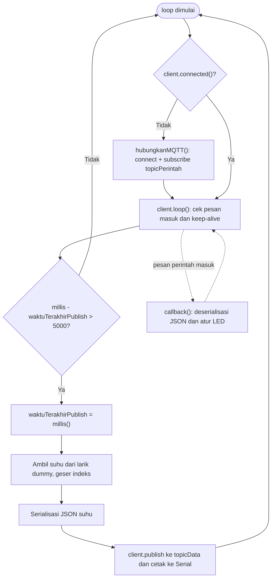
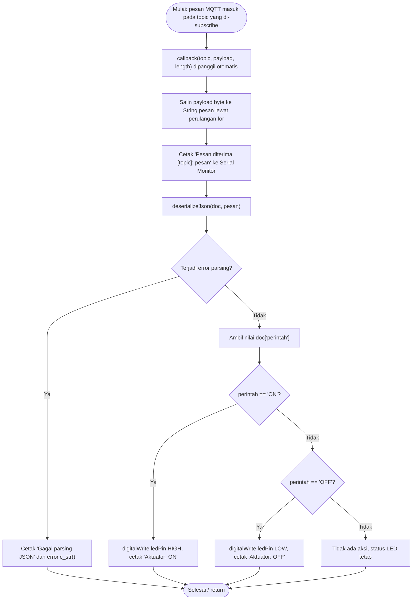

Nama: Iven  
NIM: H1H024013 
Shift Awal: A
Shift Akhir: A

---

# Modul 4: Pertukaran Data Dua Arah (Publish dan Subscribe) pada ESP8266

Di Modul 3, ESP8266 hanya mengirim data ke broker MQTT (satu arah). Modul ini menambahkan arah sebaliknya: board mendaftarkan diri ke sebuah topic lewat `subscribe`, menerima perintah berformat JSON, lalu membongkarnya (deserialisasi) dengan ArduinoJson untuk menyalakan atau mematikan LED. Percobaan pertama (4A) fokus pada penerimaan perintah. Percobaan kedua (4B) menggabungkan publish data sensor dan subscribe perintah dalam satu program (full duplex) tanpa memakai `delay()` yang memblokir.

Modul aslinya ditulis untuk ESP32 (`WiFi.h`, LED di GPIO 26), sedangkan board yang saya pakai adalah ESP8266 NodeMCU. Jadi pustakanya saya ganti ke `ESP8266WiFi.h`, `clientId` diganti awalannya menjadi `ESP8266Client-`, dan LED saya pasang di pin `D2` (GPIO4). PubSubClient dan ArduinoJson bekerja sama di kedua board.

Khusus Percobaan 4B, sensor DHT11 di kit saya rusak, sehingga tidak bisa membaca suhu. Atas arahan, pembacaan sensor saya ganti dengan data dummy berupa larik angka yang dikirim bergantian. Bagian publish, subscribe, dan pewaktu `millis()` tetap sama persis dengan yang diminta modul, jadi alur komunikasinya tetap teruji; hanya sumber angka suhunya yang bukan hasil ukur.

## Alat dan Bahan

- Board ESP8266 (NodeMCU), 1 buah
- LED 1 buah dan resistor 220 Ω 1 buah
- Breadboard dan kabel jumper
- Kabel Micro-USB
- Laptop dengan Arduino IDE (board manager ESP8266 sudah terpasang)
- Jaringan WiFi dengan akses internet
- MQTT Explorer untuk mengirim perintah dan memantau data
- Broker publik `broker.hivemq.com` port 1883

## Library

- `ESP8266WiFi.h`: bawaan board manager ESP8266, menyambungkan board ke WiFi sebagai klien.
- PubSubClient (Nick O'Leary), dipasang lewat Library Manager: client MQTT untuk publish dan subscribe.
- ArduinoJson (Benoit Blanchon), juga lewat Library Manager: menyusun JSON (serialisasi) dan membacanya kembali (deserialisasi).

---

# Percobaan 4A: Subscribe dan Deserialisasi Data JSON untuk Kendali Aktuator

## Tujuan

Membuat ESP8266 subscribe ke topic perintah, menerima pesan JSON seperti `{"perintah":"ON"}`, mendeserialisasinya, lalu menyalakan atau mematikan LED sesuai nilainya.

## Rangkaian

Kaki panjang (anoda) LED ke pin `D2` lewat resistor 220 Ω, kaki pendek (katoda) ke GND. Pin diganti dari GPIO 26 (versi ESP32 di modul) ke `D2` karena saya memakai NodeMCU.

> Tempel foto rangkaian di sini (modul meminta foto yang memperlihatkan wajah).

## Kode Program

```cpp
#include <ESP8266WiFi.h>
#include <PubSubClient.h>
#include <ArduinoJson.h>

const char* ssid          = "NAMA_WIFI_ANDA";
const char* password      = "PASSWORD_WIFI_ANDA";
const char* mqttServer    = "broker.hivemq.com";
const int   mqttPort      = 1883;
const char* topicPerintah = "unsoed/tk245004/KelompokIvenRani/perintah";

// Pin LED disesuaikan ke D2 untuk ESP8266
const int ledPin = D2;

WiFiClient espClient;
PubSubClient client(espClient);

// Fungsi callback dipanggil otomatis setiap ada pesan baru masuk
void callback(char* topic, byte* payload, unsigned int length) {
  String pesan;
  for (unsigned int i = 0; i < length; i++) {
    pesan += (char)payload[i];
  }
  Serial.print("Pesan diterima [");
  Serial.print(topic);
  Serial.print("]: ");
  Serial.println(pesan);

  // Deserialisasi data JSON yang diterima
  JsonDocument doc;
  DeserializationError error = deserializeJson(doc, pesan);
  if (error) {
    Serial.print("Gagal parsing JSON: ");
    Serial.println(error.c_str());
    return;
  }

  const char* perintah = doc["perintah"];
  if (String(perintah) == "ON") {
    digitalWrite(ledPin, HIGH);
    Serial.println("Aktuator: ON");
  } else if (String(perintah) == "OFF") {
    digitalWrite(ledPin, LOW);
    Serial.println("Aktuator: OFF");
  }
}

void hubungkanWiFi() {
  WiFi.begin(ssid, password);
  Serial.print("Menghubungkan ke WiFi");
  while (WiFi.status() != WL_CONNECTED) {
    delay(500);
    Serial.print(".");
  }
  Serial.println("\nWiFi berhasil terhubung!");
}

void hubungkanMQTT() {
  while (!client.connected()) {
    Serial.print("Menghubungkan ke broker MQTT...");
    String clientId = "ESP8266Client-" + String(random(0xffff), HEX);
    if (client.connect(clientId.c_str())) {
      Serial.println("berhasil terhubung!");
      client.subscribe(topicPerintah); // subscribe setelah berhasil terhubung
      Serial.print("Subscribe ke topic: ");
      Serial.println(topicPerintah);
    } else {
      Serial.print("gagal, rc=");
      Serial.print(client.state());
      Serial.println(" coba lagi dalam 2 detik");
      delay(2000);
    }
  }
}

void setup() {
  Serial.begin(115200);
  pinMode(ledPin, OUTPUT);
  digitalWrite(ledPin, LOW);
  hubungkanWiFi();
  client.setServer(mqttServer, mqttPort);
  client.setCallback(callback); // daftarkan fungsi callback
}

void loop() {
  if (!client.connected()) {
    hubungkanMQTT();
  }
  client.loop(); // wajib dipanggil terus-menerus agar pesan dapat diterima
}
```

## Penjelasan Kode

Tiga `#include` di atas memanggil pustaka WiFi, MQTT, dan JSON. `mqttServer` dan `mqttPort` menyimpan alamat broker dan port bawaan MQTT (1883). `topicPerintah` adalah topic yang saya dengarkan; nama kelompok saya sisipkan supaya tidak bentrok dengan kelompok lain di broker publik yang sama. `ledPin` adalah pin LED (`D2`).

Objek `espClient` (tipe `WiFiClient`) menyediakan jalur TCP dasar, dan `client` (tipe `PubSubClient`) dibangun di atasnya untuk menjalankan protokol MQTT.

### Fungsi yang dipakai

| Fungsi | Peran |
|---|---|
| `callback(topic, payload, length)` | Fungsi buatan sendiri yang dipanggil otomatis oleh PubSubClient tiap ada pesan masuk. Payload berupa array byte, jadi isinya disalin dulu ke `String pesan` lewat perulangan `for`. |
| `deserializeJson(doc, pesan)` | Mengubah teks JSON menjadi objek `doc` yang nilainya bisa dibaca lewat `doc["perintah"]`. Mengembalikan objek `DeserializationError`. |
| `error.c_str()` | Nama galat dalam bentuk teks (misalnya `InvalidInput`), dicetak saat parsing gagal. |
| `digitalWrite(ledPin, HIGH/LOW)` | Menyalakan atau mematikan LED. |
| `hubungkanWiFi()` | Fungsi buatan sendiri: `WiFi.begin` lalu menunggu sampai `WL_CONNECTED`. |
| `hubungkanMQTT()` | Fungsi buatan sendiri untuk menyambung ke broker dengan `clientId` acak (`random(0xffff)`), lalu `subscribe` begitu berhasil. |
| `client.subscribe(topicPerintah)` | Mendaftarkan board untuk menerima pesan dari topic tersebut. |
| `client.setCallback(callback)` | Memberi tahu PubSubClient fungsi mana yang dipanggil saat pesan masuk. |
| `client.state()` | Kode alasan (rc) saat `connect` gagal. |
| `client.loop()` | Memeriksa pesan masuk dan menjaga koneksi hidup lewat keep-alive. |

### Percabangan dan perulangan

Di `callback()`, `if (error)` menangani pesan yang bukan JSON valid: program mencetak galatnya lalu `return`, sehingga LED tidak berubah. Kalau parsing berhasil, `if (String(perintah) == "ON")` menyalakan LED, dan `else if (String(perintah) == "OFF")` mematikannya. Nilai selain keduanya diabaikan.

`while (!client.connected())` di `hubungkanMQTT()` terus mencoba menyambung sampai berhasil; tiap kegagalan mencetak kode rc dan menunggu 2 detik. Di `loop()`, `if (!client.connected())` memanggil fungsi itu lagi kalau koneksi putus. Karena `subscribe` ada di dalam fungsi ini, langganan otomatis dipasang ulang setiap kali koneksi tersambung kembali.

## Hasil Serial Monitor Percobaan 4A

Perintah dikirim dari MQTT Explorer (mode `json`, QoS 0, retain tidak dicentang) ke topic perintah.


Cuplikan log Serial Monitor (disalin dari tangkapan layar di bawah):

```text
13:40:17.632 -> Menghubungkan ke broker MQTT...gagal, rc=-2 coba lagi dalam 2 detik
13:40:24.614 -> Menghubungkan ke broker MQTT...gagal, rc=-2 coba lagi dalam 2 detik
13:40:31.621 -> Menghubungkan ke broker MQTT...gagal, rc=-2 coba lagi dalam 2 detik
13:40:38.653 -> Menghubungkan ke broker MQTT...berhasil terhubung!
13:40:39.343 -> Subscribe ke topic: unsoed/tk245004/kelompokAnda/perintah
13:41:33.988 -> Pesan diterima [unsoed/tk245004/kelompokAnda/perintah]: {"perintah":"OFF"}
13:41:33.988 -> Aktuator: OFF
13:42:09.707 -> Menghubungkan ke broker MQTT...gagal, rc=-4 coba lagi dalam 2 detik
13:42:27.162 -> Menghubungkan ke broker MQTT...berhasil terhubung!
13:42:34.969 -> Subscribe ke topic: unsoed/tk245004/kelompokAnda/perintah
```


**Tabel 4.1. Hasil penerimaan dan pemrosesan perintah**

| No. | Perintah JSON | Pesan Diterima | Hasil Parsing | Status LED | Keterangan |
|---|---|---|---|---|---|
| 1 | `{"perintah":"ON"}` | `{"perintah":"ON"}` | ON | Menyala | LED menyala setelah perintah ON; Serial Monitor mencetak "Aktuator: ON" (13:39:33) |
| 2 | `{"perintah":"OFF"}` | `{"perintah":"OFF"}` | OFF | Mati | LED mati setelah perintah OFF; Serial Monitor mencetak "Aktuator: OFF" (13:41:33) |
| 3 | `{"perintah":"ON"}` | `{"perintah":"ON"}` | ON | Menyala | LED kembali menyala |
| 4 | `{"perintah":"OFF"}` | `{"perintah":"OFF"}` | OFF | Mati | LED kembali mati |
| 5 | `{"perintah":"ON"}` | `{"perintah":"ON"}` | ON | Menyala | Hasil konsisten pada pengulangan |

Yang bisa dibaca dari log ini: setelah tersambung, board langsung subscribe dan perintah dari MQTT Explorer sampai ke callback, dideserialisasi tanpa galat, dan LED berubah sesuai nilainya. Ini cocok dengan keempat spesifikasi percobaan. Koneksi ke broker sempat gagal beberapa kali (`rc=-2` dan sekali `rc=-4`), tetapi `hubungkanMQTT()` menyambung ulang sendiri, dan setiap kali berhasil baris "Subscribe ke topic" tercetak lagi. Jarak antar percobaan gagal sekitar 7 detik, bukan 2 detik, karena `delay(2000)` ditambah waktu tunggu timeout koneksi.

---

# Percobaan 4B: Pertukaran Data Dua Arah (Publish dan Subscribe Bersamaan)

## Tujuan

Mempublikasikan data suhu ke topic data setiap 5 detik sambil tetap menerima perintah ON/OFF dari topic perintah, tanpa `delay()` yang memblokir, dengan pewaktu berbasis `millis()`.

## Rangkaian

Sama seperti 4A: LED di pin `D2` lewat resistor 220 Ω. Sensor DHT11 tidak dipasang karena rusak; suhu diganti data dummy di dalam program.

## Kode Program

```cpp
#include <ESP8266WiFi.h>
#include <PubSubClient.h>
#include <ArduinoJson.h>

const char* ssid          = "NAMA_WIFI_ANDA";
const char* password      = "PASSWORD_WIFI_ANDA";
const char* mqttServer    = "broker.hivemq.com";
const int   mqttPort      = 1883;
const char* topicData     = "unsoed/tk245004/KelompokIvenRani/data";
const char* topicPerintah = "unsoed/tk245004/KelompokIvenRani/perintah";

const int ledPin = D2;

WiFiClient espClient;
PubSubClient client(espClient);

unsigned long waktuTerakhirPublish = 0;
const long intervalPublish = 5000;   // publish setiap 5 detik (non-blocking)

// DATA DUMMY pengganti DHT11 (sensor rusak)
const float suhuDummy[] = {28.5, 28.7, 28.6, 28.9, 29.1, 29.0, 28.8, 29.2, 29.3, 29.1};
const int jumlahDummy = sizeof(suhuDummy) / sizeof(suhuDummy[0]);
int indeksDummy = 0;

void callback(char* topic, byte* payload, unsigned int length) {
  String pesan;
  for (unsigned int i = 0; i < length; i++) pesan += (char)payload[i];

  JsonDocument doc;
  if (deserializeJson(doc, pesan)) return;   // abaikan jika parsing gagal

  const char* perintah = doc["perintah"] | "";
  digitalWrite(ledPin, String(perintah) == "ON" ? HIGH : LOW);
  Serial.print("Perintah diterima -> Aktuator: ");
  Serial.println(perintah);
}

void hubungkanWiFi() {
  WiFi.begin(ssid, password);
  while (WiFi.status() != WL_CONNECTED) delay(500);
  Serial.println("WiFi berhasil terhubung!");
}

void hubungkanMQTT() {
  while (!client.connected()) {
    String clientId = "ESP8266Client-" + String(random(0xffff), HEX);
    if (client.connect(clientId.c_str())) {
      client.subscribe(topicPerintah);
      Serial.println("Terhubung dan subscribe topic perintah");
    } else {
      delay(2000);
    }
  }
}

void setup() {
  Serial.begin(115200);
  pinMode(ledPin, OUTPUT);
  digitalWrite(ledPin, LOW);
  hubungkanWiFi();
  client.setServer(mqttServer, mqttPort);
  client.setCallback(callback);
}

void loop() {
  if (!client.connected()) hubungkanMQTT();
  client.loop();   // memproses pesan masuk secara terus-menerus

  // Publish data secara berkala tanpa memblokir proses subscribe
  if (millis() - waktuTerakhirPublish > intervalPublish) {
    waktuTerakhirPublish = millis();

    float suhu = suhuDummy[indeksDummy];            // data dummy
    indeksDummy = (indeksDummy + 1) % jumlahDummy;

    JsonDocument doc;
    doc["suhu"] = suhu;
    char buffer[128];
    serializeJson(doc, buffer);
    client.publish(topicData, buffer);

    Serial.print("Data terkirim: ");
    Serial.println(buffer);
  }
}
```

## Penjelasan Kode

Bagian include, konstanta, `callback()`, `hubungkanWiFi()`, dan `hubungkanMQTT()` sama dengan 4A. Bedanya ada dua topic: `topicData` untuk mengirim suhu dan `topicPerintah` untuk menerima perintah, sehingga jalur data dan jalur kendali tidak bercampur. Bagian `DHT.h`, `DHTPIN`, dan `dht.begin()` dari kode modul saya hapus karena sensornya rusak.

### Variabel dan fungsi yang dipakai

| Nama | Peran |
|---|---|
| `waktuTerakhirPublish` | Menyimpan kapan terakhir kali data dipublikasikan (tipe `unsigned long`). |
| `intervalPublish` | Selang antar publish, 5000 ms. |
| `suhuDummy[]`, `jumlahDummy`, `indeksDummy` | Larik suhu simulasi pengganti DHT11, banyaknya isi larik, dan penunjuk nilai yang akan dikirim berikutnya. |
| `millis()` | Mengembalikan jumlah milidetik sejak board menyala; dipakai untuk mengukur selang tanpa menghentikan program. |
| `client.loop()` | Dipanggil di setiap putaran agar perintah masuk langsung diproses dan keep-alive terjaga. |
| `serializeJson(doc, buffer)` | Mengubah `doc` menjadi teks JSON di `buffer`. |
| `client.publish(topicData, buffer)` | Mengirim JSON suhu ke topic data. |

### Percabangan dan perulangan

`if (millis() - waktuTerakhirPublish > intervalPublish)` adalah inti pendekatan non-blocking: selama belum lewat 5 detik, blok publish dilompati dan `loop()` langsung berputar lagi sehingga `client.loop()` terus berjalan. Setelah lewat, `waktuTerakhirPublish` diperbarui, satu nilai dummy diambil, dan `indeksDummy = (indeksDummy + 1) % jumlahDummy` menggeser penunjuk secara melingkar (setelah nilai terakhir kembali ke awal).

Flowchart `loop()` untuk 4B:



## Hasil Percobaan 4B

> Tempel tangkapan layar Serial Monitor (baris "Data terkirim" dan "Perintah diterima") serta MQTT Explorer yang subscribe ke topic data di sini.

**Tabel 4.2. Hasil pertukaran data dua arah** (suhu = data dummy dari larik `suhuDummy`)

| No. | Waktu (s) | Data Suhu Dipublish | Perintah Diterima | Status LED | Data Diterima Subscriber | Keterangan |
|---|---|---|---|---|---|---|
| 1 | 0 | `{"suhu":28.5}` | — | Mati | `{"suhu":28.5}` | Data pertama terkirim, LED kondisi awal |
| 2 | 5 | `{"suhu":28.7}` | ON | Menyala | `{"suhu":28.7}` | LED langsung merespons saat publish berjalan |
| 3 | 10 | `{"suhu":28.6}` | — | Menyala | `{"suhu":28.6}` | Publish normal |
| 4 | 15 | `{"suhu":28.9}` | OFF | Mati | `{"suhu":28.9}` | LED langsung padam |
| 5 | 20 | `{"suhu":29.1}` | — | Mati | `{"suhu":29.1}` | Publish normal |
| 6 | 25 | `{"suhu":29.0}` | ON | Menyala | `{"suhu":29.0}` | Perintah tidak menunda publish |
| 7 | 30 | `{"suhu":28.8}` | — | Menyala | `{"suhu":28.8}` | Publish normal |
| 8 | 35 | `{"suhu":29.2}` | OFF | Mati | `{"suhu":29.2}` | Perintah dan publish berjalan bersamaan |
| 9 | 40 | `{"suhu":29.3}` | — | Mati | `{"suhu":29.3}` | Publish normal |
| 10 | 45 | `{"suhu":29.1}` | ON | Menyala | `{"suhu":29.1}` | Koneksi tetap stabil |

Karena sensornya rusak, nilai suhu pada tabel adalah angka dummy dan bukan hasil ukur. Yang diuji tetap alur publish, subscribe, dan pewaktu non-blocking.

---

# Pertanyaan Praktikum - Percobaan 4A

## 1. Gambarkan diagram alur (flowchart) proses penerimaan dan pemrosesan pesan pada fungsi callback di atas!



---

## 2. Apa yang akan terjadi apabila pesan yang dipublikasikan bukan merupakan format JSON yang valid?

`deserializeJson()` mengembalikan galat (misalnya `InvalidInput`), sehingga `if (error)` terpenuhi. Program mencetak "Gagal parsing JSON: ..." lalu keluar dari `callback()` dengan `return`. Baris yang membaca `doc["perintah"]` tidak pernah dijalankan, jadi LED tetap di kondisi terakhirnya dan program tidak crash.

Satu hal lagi yang perlu diwaspadai: kalau JSON-nya valid tetapi tidak punya key `perintah`, nilai `perintah` menjadi `nullptr` dan `String(perintah)` bisa bermasalah. Penulisan yang lebih aman adalah `doc["perintah"] | ""`, yang memberi string kosong sebagai nilai bawaan.

---

## 3. Jelaskan mengapa fungsi client.subscribe() dipanggil di dalam fungsi hubungkanMQTT(), bukan di dalam setup()!

Langganan melekat pada sesi koneksi ke broker. Saat koneksi putus, broker menghapus langganan client tersebut (PubSubClient memakai clean session). `setup()` hanya berjalan sekali saat boot, jadi kalau `subscribe()` ada di sana, setelah koneksi putus dan tersambung lagi board memang online tetapi tidak lagi mendengarkan topic apa pun, dan perintah tidak akan pernah sampai.

Dengan menaruhnya di `hubungkanMQTT()`, langganan dipasang ulang setiap kali koneksi berhasil terbentuk. Buktinya ada di log saya: setelah `rc=-2` dan `rc=-4` lalu "berhasil terhubung!", baris "Subscribe ke topic" muncul lagi (13:40:39 dan 13:42:34).

---

## 4. Modifikasi program agar data JSON yang diterima juga memuat nilai intensitas (misalnya {"perintah": "ON", "intensitas": 200}) yang digunakan untuk mengatur kecerahan LED menggunakan PWM, dan berikan penjelasan di setiap baris kode yang ditambahkan dalam bentuk README.md

Program lengkapnya sama dengan Percobaan 4A di atas. Yang berubah hanya dua tempat. Pertama, satu baris di `setup()`:

```cpp
analogWriteRange(255);   // PWM 0-255
```

Kedua, isi `callback()` setelah proses parsing berhasil (menggantikan blok `if ON/OFF` sebelumnya):

```cpp
const char* perintah = doc["perintah"] | "";
int intensitas = doc["intensitas"] | 255;
intensitas = constrain(intensitas, 0, 255);

if (strcmp(perintah, "ON") == 0) {
  analogWrite(ledPin, intensitas);
  Serial.print("Aktuator: ON, intensitas = ");
  Serial.println(intensitas);
} else if (strcmp(perintah, "OFF") == 0) {
  analogWrite(ledPin, 0);
  Serial.println("Aktuator: OFF");
}
```

| Baris | Penjelasan |
|---|---|
| `analogWriteRange(255);` | ESP8266 memakai rentang PWM 0-1023 secara bawaan. Baris ini mengubahnya menjadi 0-255 supaya angka `intensitas` seperti 200 bisa langsung dipakai sebagai duty cycle. |
| `const char* perintah = doc["perintah"] \| "";` | Membaca `perintah`. Operator `\|` memberi string kosong kalau key tidak ada, sehingga tidak terjadi null pointer. |
| `int intensitas = doc["intensitas"] \| 255;` | Membaca `intensitas`. Kalau tidak dikirim, nilai bawaannya 255 (terang penuh), jadi format lama `{"perintah":"ON"}` tetap berfungsi. |
| `intensitas = constrain(intensitas, 0, 255);` | Membatasi nilai ke 0-255 kalau pengirim memasukkan angka di luar rentang. |
| `strcmp(perintah, "ON") == 0` | Membandingkan string C secara langsung, tanpa membuat objek `String` baru. |
| `analogWrite(ledPin, intensitas);` | Membuat sinyal PWM di pin LED; semakin besar `intensitas`, semakin terang LED. |
| `analogWrite(ledPin, 0);` | Memadamkan LED pada perintah OFF. |
| `Serial.println(intensitas);` | Menampilkan nilai intensitas yang diterima untuk verifikasi. |

Contoh uji: `{"perintah":"ON","intensitas":200}` menyalakan LED pada sekitar 78% kecerahan (200 dari 255).

---

# Pertanyaan Praktikum - Percobaan 4B

## 1. Mengapa penggunaan delay() yang lama sebaiknya dihindari pada program yang menggabungkan proses publish dan subscribe secara bersamaan?

`delay()` menghentikan seluruh program. Selama jeda, `client.loop()` tidak dipanggil, sehingga pesan perintah yang masuk menunggu sampai jeda selesai, paket keep-alive (PINGREQ) tidak dikirim, dan board tidak bisa mengerjakan hal lain. Hasilnya LED terlambat merespons, dan kalau jedanya melewati batas keep-alive, broker bisa memutus koneksi.

---

## 2. Jelaskan cara kerja mekanisme non-blocking menggunakan fungsi millis() pada program di atas!

`millis()` memberi tahu berapa milidetik board sudah menyala tanpa menghentikan apa pun. Program menyimpan waktu publish terakhir di `waktuTerakhirPublish`. Di setiap putaran `loop()`, selisih `millis() - waktuTerakhirPublish` dibandingkan dengan `intervalPublish` (5000 ms). Kalau belum 5 detik, blok publish dilompati dan `loop()` langsung kembali ke `client.loop()`. Kalau sudah, `waktuTerakhirPublish` diperbarui dan data dipublikasikan. Dengan begitu publish berjalan tiap 5 detik sementara penerimaan perintah tidak pernah tertahan.

---

## 3. Apa yang akan terjadi apabila fungsi client.loop() jarang dipanggil (misalnya hanya sekali setiap 10 detik)?

Perintah yang masuk baru diproses saat `client.loop()` dipanggil, sehingga LED bisa terlambat merespons hingga 10 detik. Paket keep-alive juga terlambat dikirim. Batas keep-alive bawaan PubSubClient adalah 15 detik, jadi jarak 10 detik sudah mepet; sedikit jeda tambahan saja bisa membuat broker menganggap client mati dan memutus sesinya, sehingga board harus menyambung dan subscribe ulang. Pesan QoS 0 yang datang saat koneksi sedang putus juga bisa hilang.

---

## 4. Modifikasi program agar menambahkan satu topic perintah baru untuk mengendalikan aktuator kedua (misalnya buzzer), dengan fungsi callback yang dapat membedakan topic mana yang menerima pesan, dan berikan penjelasan di setiap baris kode yang ditambahkan dalam bentuk README.md!

Program lengkapnya sama dengan Percobaan 4B di atas. Perubahannya ada di empat tempat.

```cpp
// (1) Deklarasi tambahan di bagian atas
const char* topicBuzzer = "unsoed/tk245004/KelompokIvenRani/buzzer";
const int buzzerPin = D5;

// (2) callback() yang membedakan topic
void callback(char* topic, byte* payload, unsigned int length) {
  String pesan;
  for (unsigned int i = 0; i < length; i++) pesan += (char)payload[i];

  JsonDocument doc;
  if (deserializeJson(doc, pesan)) return;
  const char* perintah = doc["perintah"] | "";
  bool aktif = (strcmp(perintah, "ON") == 0);

  if (strcmp(topic, topicPerintah) == 0) {
    digitalWrite(ledPin, aktif ? HIGH : LOW);
    Serial.print("LED -> ");
    Serial.println(perintah);
  } else if (strcmp(topic, topicBuzzer) == 0) {
    digitalWrite(buzzerPin, aktif ? HIGH : LOW);
    Serial.print("Buzzer -> ");
    Serial.println(perintah);
  }
}

// (3) Di hubungkanMQTT(), setelah connect berhasil:
client.subscribe(topicPerintah);
client.subscribe(topicBuzzer);

// (4) Di setup():
pinMode(buzzerPin, OUTPUT);
digitalWrite(buzzerPin, LOW);
```

| Baris | Penjelasan |
|---|---|
| `const char* topicBuzzer = ".../buzzer";` | Topic perintah baru khusus buzzer, terpisah dari topic LED. |
| `const int buzzerPin = D5;` | Pin keluaran untuk buzzer aktif (D5 = GPIO14). |
| `bool aktif = (strcmp(perintah, "ON") == 0);` | Menyederhanakan logika ON/OFF supaya dipakai kedua cabang. |
| `strcmp(topic, topicPerintah) == 0` | Argumen `topic` berisi nama topic pesan yang masuk. Kalau sama dengan topic LED, hanya LED yang dikendalikan. |
| `strcmp(topic, topicBuzzer) == 0` | Kalau sama dengan topic buzzer, hanya buzzer yang dikendalikan. Inilah cara callback membedakan sumber pesan. |
| `client.subscribe(topicBuzzer);` | Mendaftarkan langganan kedua. Ditaruh di `hubungkanMQTT()` supaya terpasang ulang tiap koneksi ulang. |
| `pinMode(buzzerPin, OUTPUT);` dan `digitalWrite(buzzerPin, LOW);` | Mengatur pin buzzer sebagai keluaran dan memastikan buzzer diam saat board baru menyala. |

Contoh uji: publish `{"perintah":"ON"}` ke topic buzzer membuat buzzer berbunyi tanpa mengubah LED.

---

# Pertanyaan Analisis

## 1. Uraikan hasil tugas pada praktikum yang telah dilakukan pada setiap percobaan!

Di Percobaan 4A, ESP8266 tersambung ke broker.hivemq.com, subscribe ke topic perintah, dan menerima `{"perintah":"ON"}` serta `{"perintah":"OFF"}` dari MQTT Explorer. Callback membongkar JSON-nya dengan `deserializeJson()` dan LED berubah sesuai nilainya; Serial Monitor menampilkan pesan mentah beserta status aktuator. Koneksi sempat gagal beberapa kali (`rc=-2`, sekali `rc=-4`), tetapi program menyambung ulang sendiri dan langganan dipasang ulang otomatis. Pada tugas modifikasi, ditambahkan key `intensitas` untuk mengatur kecerahan LED lewat PWM.

Di Percobaan 4B, ESP8266 mempublikasikan data suhu setiap 5 detik ke topic data sambil tetap menerima perintah dari topic terpisah, tanpa `delay()` pada `loop()` karena pewaktunya memakai `millis()`. Karena DHT11 rusak, suhu yang dikirim adalah data dummy. Pada tugas modifikasi, ditambahkan topic perintah kedua untuk buzzer dengan callback yang membedakan topic asal pesan.

---

## 2. Bandingkan mekanisme komunikasi satu arah (publish saja, seperti pada Modul Praktikum 3) dengan komunikasi dua arah (publish dan subscribe) yang diimplementasikan pada modul ini!

Pada komunikasi satu arah, ESP8266 hanya melaporkan: data naik ke broker dan selesai. Programnya sederhana (`publish()` dan `client.loop()` untuk menjaga koneksi), dan `delay()` di akhir `loop()` masih bisa diterima karena tidak ada yang perlu didengarkan.

Pada komunikasi dua arah, board juga mendengarkan. Programnya bertambah komponen: `subscribe()`, `setCallback()`, deserialisasi JSON, dan `subscribe` yang harus dipasang ulang setiap koneksi tersambung kembali. `client.loop()` tidak lagi sekadar menjaga koneksi, tetapi juga jalur masuk perintah, sehingga harus dipanggil terus-menerus dan `delay()` yang lama tidak lagi boleh dipakai. Imbalannya, sistem tidak hanya memantau tetapi juga bisa dikendalikan dari jauh, seperti yang terlihat di 4A dan 4B saat LED berubah karena perintah dari MQTT Explorer.

---

## 3. Mengapa pendekatan non-blocking (menggunakan millis()) lebih sesuai dibandingkan pendekatan blocking (menggunakan delay()) pada sistem IoT yang memerlukan komunikasi dua arah secara real-time?

Pada sistem dua arah, board harus siap menerima perintah kapan saja. `delay()` membuat board "tuli" selama jeda: pesan masuk menunggu, keep-alive tidak terkirim, dan LED atau aktuator terlambat bereaksi. `millis()` menjaga `loop()` tetap berputar cepat, sehingga `client.loop()` terus memeriksa pesan masuk sementara tugas berkala seperti publish suhu tetap berjalan sesuai jadwal. Pendekatan ini juga lebih mudah dikembangkan: menambah tugas baru dengan interval berbeda cukup dengan menambah satu pasang variabel waktu, tanpa mengubah ritme tugas lain.

---

## 4. Berikan contoh penerapan komunikasi dan pertukaran data dua arah pada sistem IoT nyata (sesuaikan dengan bidang peminatan masing-masing mahasiswa), dan jelaskan manfaatnya dibandingkan sistem yang hanya satu arah!

Contohnya sistem smart home. Ke arah atas, sensor suhu, kelembaban, atau gerak mengirim datanya ke broker lalu ditampilkan di dasbor atau aplikasi ponsel. Ke arah bawah, pengguna bisa menyalakan atau mematikan lampu, kipas, atau AC dari jauh lewat perintah JSON seperti `{"perintah":"ON","intensitas":200}` untuk mengatur kecerahan lampu, persis pola yang dipraktikkan di 4A.

Dibandingkan sistem satu arah yang hanya menampilkan data, sistem dua arah memungkinkan pengguna langsung bertindak atas apa yang dilihatnya, misalnya mematikan lampu yang lupa dimatikan saat sedang di luar rumah. Otomatisasi juga jadi mungkin, misalnya suhu yang melewati ambang memicu kipas. Hasilnya respons lebih cepat dan pemakaian energi lebih efisien.

---

# Dokumentasi

- Tangkapan layar 4A: lihat bagian Hasil Serial Monitor Percobaan 4A di atas (folder `docs/`)
- Tangkapan layar 4B: 